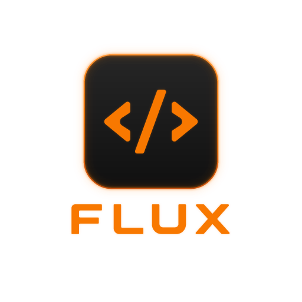
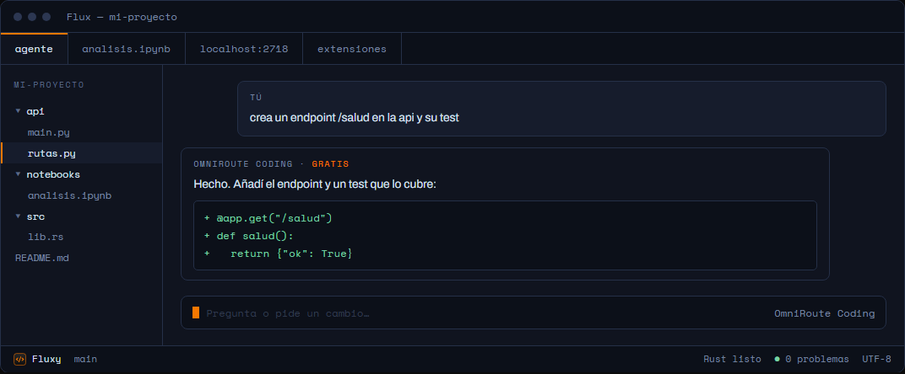

  

<h1 align="center">Flux</h1>

<strong>Tus extensiones de VS Code, sin VS Code. Y con IA gratis dentro.</strong>

Versión 1.16.1 · Windows 10/11 (64 bits) · GPL-3.0-or-later

---

## Descargar

  <a href="https://github.com/JuanManiglia/flux-releases/releases/latest/download/Flux-Setup.exe"><strong>Descargar Flux-Setup.exe</strong></a>

El instalador no está firmado digitalmente, así que Windows avisará de "editor desconocido":
**Más información → Ejecutar de todas formas**.

| Instalador (recomendado) | Zip portable | Código fuente |
|---|---|---|
| [Flux-Setup.exe](https://github.com/JuanManiglia/flux-releases/releases/latest/download/Flux-Setup.exe) · 153 MB | [Flux-windows-x64.zip](https://github.com/JuanManiglia/flux-releases/releases/latest/download/Flux-windows-x64.zip) · 251 MB | [Flux-codigo-fuente.zip](https://github.com/JuanManiglia/flux-releases/releases/latest/download/Flux-codigo-fuente.zip) · GPL-3.0 |

Todas las versiones, con sus notas de cambios, están en la [página de releases](https://github.com/JuanManiglia/flux-releases/releases).

## Qué es Flux

Flux es un editor de código para Windows: un fork de [Zed](https://github.com/zed-industries/zed)
(Rust, GPL-3.0-or-later) que además ejecuta extensiones del ecosistema de VS Code —Claude Code,
Codex, GitLens y las demás— sin tener VS Code instalado. Trae su propio motor de extensiones,
compilado de la parte libre de VS Code.

También abre notebooks de Jupyter, muestra apps web locales como pestañas del propio editor, y
trae un asistente de IA que no cuesta nada, activable en un clic. No envía datos a ninguna parte:
la telemetría viene desactivada de fábrica.

Es un proyecto personal en fase alfa: funciona, pero conviene esperar asperezas.

## Lo que trae de serie

- **Extensiones de VS Code.** Flux incluye su propio motor de extensiones, compilado de la parte
  libre de VS Code. Descomprimes y funciona: nada más que instalar.
- **Claude Code y Codex.** Los agentes de Anthropic y OpenAI corren como paneles del editor, con
  tu propia cuenta de cada uno. Sin API keys ni pagos aparte.
- **IA gratis en un clic.** Un botón instala y conecta OmniRoute: los niveles gratuitos de
  decenas de proveedores de IA, unificados en el asistente del editor.
- **Notebooks de Jupyter.** Abre notebooks con sus celdas, añade código o markdown con un clic y
  ejecútalas sin salir del editor.
- **Apps web en pestañas.** Cualquier app local (marimo, JupyterLab, paneles de control) se abre
  como una pestaña más, sin saltar al navegador.
- **Rápido y privado.** Arranca al instante y no envía datos a ninguna parte: la telemetría viene
  desactivada de fábrica.

  

Maqueta del editor Flux, con el panel de IA gratis abierto.

## Instalar en dos minutos

1. **Ejecuta el instalador.** Descarga y abre `Flux-Setup.exe`. Windows avisará de que el editor
   es desconocido: **Más información → Ejecutar de todas formas**.
2. **Siguiente → Instalar.** Flux queda en el menú Inicio, con desinstalador y actualizaciones de
   un clic, y se abre solo al terminar.
3. **Activa la IA gratis (opcional).** Instala [Node.js](https://nodejs.org/es) y pulsa
   **Fluxy → Activar IA gratis**. El resto es automático.

Tu antivirus también puede ponerse nervioso, sobre todo Norton, que a veces mete el ejecutable en
cuarentena sin avisar. Si Flux desaparece de la carpeta o no arranca, revisa la cuarentena de tu
antivirus y añade una exclusión para la carpeta donde lo instalaste.

¿Prefieres sin instalador? El zip portable se descomprime entero y ejecutas `flux.exe` sin
separar la carpeta `reh` que trae al lado.

## IA gratis

Flux trae un asistente de programación integrado que escribe y modifica código por ti. Para
usarlo sin pagar ninguna suscripción usa [OmniRoute](https://github.com/diegosouzapw/OmniRoute),
un programa libre que reúne los niveles gratuitos de decenas de proveedores de IA.

Actívalo desde **Fluxy → Activar IA gratis** (pide tener [Node.js](https://nodejs.org/es)
instalado). Flux descarga OmniRoute y lo deja corriendo; a partir de ahí arranca solo cada vez
que abres el editor. Después, en el panel del asistente, elige el modelo **OmniRoute Coding**.

Consejo que multiplica la calidad: crea cuentas gratuitas y sin tarjeta en
[Google AI Studio](https://aistudio.google.com/apikey) y [Groq](https://console.groq.com/keys),
genera una API key en cada una, y pégalas en **Fluxy → Abrir panel de OmniRoute** (sección
*Providers*). Con eso el enrutador usa Gemini y Groq en vez de los modelos comunitarios.

Aviso honesto: lo que escribas en ese chat viaja al proveedor de IA que toque en cada momento
(Google, Groq, DeepSeek u otros, según disponibilidad). Para código muy privado, tenlo en cuenta.

## Problemas conocidos

- **Un panel se ve transparente, o se ve el escritorio a través de él.** Minimiza y maximiza la
  ventana; es un fallo del primer dibujado de los paneles web.
- **Un panel de extensión sale vacío.** Cierra Flux y vuelve a abrirlo.
- **El icono de Flux en el acceso directo o la barra de tareas sigue siendo el antiguo tras
  actualizar.** Es la caché de iconos de Windows. Se arregla cerrando sesión, o reiniciando el
  Explorador de Windows (Administrador de tareas → Explorador de Windows → Reiniciar).
- **Aviso "Critical: ... couldn't load its resources" al primer arranque tras actualizar.** Es
  transitorio: acepta el aviso, cierra Flux y vuelve a abrirlo.
- **Las extensiones no arrancan.** Casi siempre es que `flux.exe` quedó separado de su carpeta
  `reh`. Descomprime el zip entero otra vez y ejecuta `flux.exe` desde ahí, sin mover nada.

## Actualizaciones

Flux comprueba sus propias releases de este repositorio al arrancar y, si hay una versión nueva,
ofrece instalarla con un botón. También puedes buscarla a mano desde **Ayuda → Buscar
actualización de Flux**. Flux nunca consulta el servidor de actualizaciones de Zed.

## Código fuente y licencia

Flux es software libre bajo **GPL-3.0-or-later**: una versión modificada de
[Zed](https://github.com/zed-industries/zed), de Zed Industries, Inc. Cada release de este
repositorio incluye `Flux-codigo-fuente.zip` con el código fuente correspondiente a esa versión.

Las extensiones de VS Code que instales dentro de Flux son software de terceros, con sus propias
licencias y condiciones. Flux no las distribuye: solo las ejecuta.

## Más información

- Página del proyecto: [flux-landing-three.vercel.app](https://flux-landing-three.vercel.app)
- Guía completa de instalación y uso: el archivo `INSTALAR.txt` que viene dentro del zip
  portable y que instala el propio `Flux-Setup.exe`.
- Todas las versiones: [releases de este repositorio](https://github.com/JuanManiglia/flux-releases/releases)
